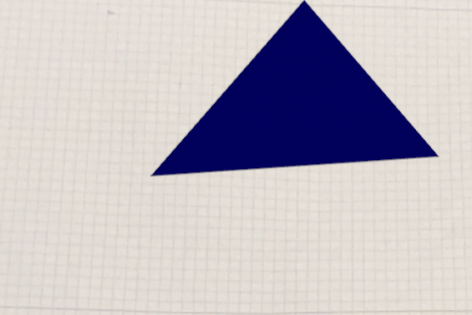

# swift-ar-with-reality-kit

## Table of Contents

+ [Summary](#summary)
+ [Features](#features)
+ [Getting started](#getting-started)

## Summary

Immersive and interactive augmented reality (AR) sample applications using the Swift programming language and Apple's RealityKit framework

## Features

- [ ] Compilation on iOS
- [ ] USD scene loading

## Getting started

### Preconditions

- MacOS device with XCode version >=15.3
- iOS 17.4 device

### Steps

Launch one of the [sample applications](./apps/) in Xcode. Connect your iOS device to your macOS device. Then build and run the applications on the designated iOS device

Results for the [Triangle application](./apps/Triangle/) should resemble:

